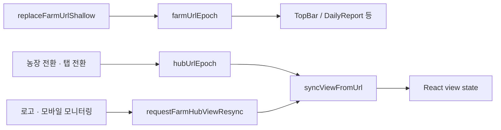

# `/farm` 허브 URL · 셸 계약

허브 셸·라우팅 소유. 구현: `src/lib/farm/farm-view-url.ts`, `farm-page-content.tsx`.  
Cursor 규칙: `.cursor/rules/farm-shell-routing.mdc`.

디자인(모션)·ARIA(프로토콜)는 이 스키마를 **소비만** 하고 키 의미를 바꾸지 않는다.

---

## Feature flag — 필드 통합 (P0)

| 환경변수 | 기본 | 설명 |
|----------|------|------|
| `NEXT_PUBLIC_FARM_FIELD_MERGE_V1` | **on** (`false`/`0`/`off`만 끔) | 그리드·목록 → «필드» 탭. off면 그리드·목록·차트 분리 |

통합 on일 때 UI:
- 상위 탭: **필드 · 차트**
- 판정 단위는 **컨트롤러 영향범위**(카드 1장). 방 칸 히트맵 탭(`view=status`)은 제거. 옛 주소는 필드로 정규화
- DELIN: 필드 **우측 하단 뱃지** (`NEXT_PUBLIC_DELIN_ENABLED`). 차트·목록에서는 숨김. 전용 탭 없음. `view=aria`/`jarvis` → 필드
- PC 필드: ScopeBar 스티키 없음 — 농장 선택은 **계정 메뉴**, 보기 탭은 **TopBar**
- 모바일 compact: 보기 탭은 **하단 독** (`DashboardViewportShell`)
- 좌 카드 선택 → 우측 **해당 축사 컨트롤러만**. 「전체보기」·같은 카드 재탭으로 전체 복귀
- 좌 현황 숨기기/나타내기 · 카드 헤더 단일 순환 버튼
- 모바일: 그리드만 + 카드 탭 시 Bottom sheet 직행 (인라인 상세 없음)
- 모바일 상세 «차트로 옮기기»: 차트 탭으로 이동하며 그 그래프가 **펼쳐집니다**. 필드 탭으로 돌아와도 `chartW1`/`chartW2`는 유지

---

## 쿼리 키

| 키 | 값 | 기본 | 설명 |
|----|-----|------|------|
| `lsind` / `item` | 농장 키 | (권한·서버) | 활성 농장. soft home에서 **유지** |
| `view` | `list` \| `chart` \| (`chartlab`→차트, `aria`/`jarvis`/`status`/`plan`/`model`→필드) | **없음 = 그리드(map)** | 상단 탭. 옛 델린·현황 히트맵·모델 주소는 필드. 필드에서 DELIN 권장 뱃지(차트·목록은 숨김). `chartlab`은 `chart`로 정규화 |
| `trendPeriod` | `24h` \| `30d` | **없음 = 7d** | 그리드·목록·차트 공유 기간. 기본 `7d`는 URL 생략 |
| `sp` | 축사유형 코드 | — | 그리드 드릴 (SP 그래프) |
| `mapLevel` | `stalls` | 없음=sp | 그리드 드릴 단계 |
| `stall` | 축사번호 | — | 그리드 컨트롤러 포커스 |
| `listMode` | `controller` \| `graph` \| `settings` | `controller`(생략) | 목록 탭 모드. 레거시 `channel`은 **읽기만** `graph`로 매핑·정규화 |
| `listLayout` | `group` | 없음=`flat` | 목록 레이아웃 |
| `ctrl` | 컨트롤러 키 | — | 목록 포커스 |
| `alarm` | 알람 id | — | 딥링크 |
| `chartSp` | 축사유형 코드 | — | 차트 집계 (유형). 맵 `sp`와 분리 |
| `chartStall` | 축사번호 | — | 차트 집계 (축사). `chartSp` 필요 |
| `chartCtrl` | 컨트롤러 키 | — | 차트 집계 트리 선택(컨트롤러). `chartSp`+`chartStall` 필요. 명령 이력 대상. `URLSearchParams`가 인코딩함. 옛 `%253A` 이중 인코딩은 읽기에서 복원 |
| `chartW1` / `chartW2` | `축사유형\|축사번호\|컨트롤러키` 또는 `-` | — | 목록·펼침 선택. **3칸**. 4칸 이상(키가 한 번 더 붙은 옛 URL)은 앞 3칸만 사용. `-`는 빈 칸(집계 딥링크 재시드 방지). 없으면 `chartCtrl`을 위로 시드. 칸 없음=목록(축사유형 평균), `W1`만=해당 **컨트롤러 개별 그래프**. `W1`+`W2`=두 컨트롤러 개별 그래프 비교(다른 축사·유형도 가능) |
| `chartYBand` | `temp` \| `hum` \| `motor` (+로 복수). 레거시 `command`는 `chartCmd`로 해석 | — | 지표 집중(Y밴드). 칩·드래그·델린 handoff |
| `chartCmd` | `1` | — | 컨트롤러 집계에서 온도·모터 본선 **명령 이력**(A/B/C 창·선). 집계 트리 컨트롤러 행 「명령」 토글 |
| `chartX0` / `chartX1` | 0–1 비율 | — | 집중·줌의 시간 구간(전체면 생략) |

레거시 `tab=ops|…` 는 미들웨어·페이지에서 `/farm`으로 정리. 신규 코드는 `tab` 쓰지 않음.

레거시 `listMode=channel`: `parseListViewMode` → `graph`. 목록 탭 진입 시 `normalizeLegacyListModeParam`으로 URL을 `graph`로 고쳐 씀 (쓰기·타입에 `channel` 없음).

---

## 탭 (`view`)

```
resolveFarmHubView(raw)
  list  → list
  chart → chart
  chartlab → chart  // 옛 테스트 탭
  plan | model → map  // 은퇴한 모델 탭
  aria | jarvis → map   // 옛 델린 탭
  status → map          // 레거시 현황(방 칸 히트맵) 탭
  else  → map   // view 없음·알 수 없음
```

| 전환 헬퍼 | 부수 효과 |
|-----------|-----------|
| `applyMapGridParams` | `view`·`listMode`·drill·집계·줌·명령·잔여 `plan*` 제거. **위젯 칸(`chartW1`/`chartW2`)은 유지** |
| `applyListViewParams` | `view=list`, `stall`·`mapLevel` 제거 (`sp` 유지 가능). 잔여 `plan*` 정리 |
| `applyChartViewParams` | `view=chart`, `listMode`·`stall`·`mapLevel` 제거 (`chart*` 유지). 잔여 `plan*` 정리 |
| `applyChartLabViewParams` | `applyChartViewParams`와 동일 (옛 `view=chartlab`) |
| `applyAriaViewParams` | 필드(그리드)로 정규화. 옛 `view=aria` 호환 |
| `applyHubScopedViewParams(view)` | 위 + 레거시 `tab` 삭제 |
| `pinFarmHubViewParam(view)` | **탭만** 고정. `list`/`chart`는 `view` 유지. `chartlab`→`chart`. drill·`chart*` 유지 (기간 변경용) |

### 차트 집계 딥링크

- 헬퍼: `resolveFarmChartScope` / `applyFarmChartScopeParams` / `clearFarmChartScopeParams` (`farm-chart-scope.ts`)
- 범위 변경: shallow + `pinFarmHubViewParam(chart)` — **hub epoch 올리지 않음**
- 목록·soft home·농장 전환 시 `chart*` 전부 제거. 필드(맵) 전환은 집계·줌·명령만 제거하고 위젯 칸은 유지
- 예: `/farm?lsind=…&item=…&view=chart&trendPeriod=7d&chartSp=SP03&chartStall=1`
- 줌 예: `chartYBand=temp+command&chartX0=0.2&chartX1=0.6` — 온도·명령 레인 집중 + 시간 구간
- 목록·펼침 계약: `farmChartLabSelectionFromWidgetSlots` / `applyFarmChartLabSelectionParams`. 차트 탭이 이 계약을 화면에 쓴다. `W1`+`W2`는 비교 모드. 아래칸만 있으면 기준으로 올려 위칸에 쓴다. `chartSp`/`chartCmd`/`chartYBand`/`chartX0`는 읽기만 유지

---

## Soft home

농장·기간만 남기고 탭/드릴/목록모드를 벗긴 **그리드 홈**.

- 헬퍼: `buildFarmMonitoringHomeParams` / `buildFarmMonitoringHomePath` / `isFarmMonitoringSoftHome`
- 진입점:
  - PC: 좌측 상단 로고 (`AppHeaderBrand`)
  - 모바일 compact: 로고 홈 · 하단 보기 독은 탭 전환용 (구 «모니터링» 하단 내비와 별개)
- 유지: `lsind`, `item`, `trendPeriod`(7d|30d)
- 제거: `view`, drill, `listMode`, `ctrl`, `alarm`, `chart*`, `plan*`
- 이미 soft home이면 no-op

농장 전환 시: `clearHubFarmDrillParams` + 새 `lsind`/`item` (기간은 유지하는 편이 일반적).

**Capacitor(네이티브):** shallow/`router.push`만 쓰면 `window.location`과 RSC 스코프가 어긋나 허브 빈 문구가 남을 수 있다.  
`FarmSwitcher`는 네이티브에서 `window.location.assign`으로 document 로드해 SSR 단건 패널을 확정한다.

---

## Shallow URL vs Next `useSearchParams`

탭·드릴·기간은 주로 `window.history.replaceState` (`replaceFarmUrlShallow`).

| API | 용도 |
|-----|------|
| `currentFarmSearchParams()` | `/farm`에서 **읽을 때** 기준 (window) |
| `replaceFarmUrlShallow(params)` | 쓰기 + `farmUrlEpoch` bump |
| `useSearchParams()` | SSR·첫 페인트·비 shallow 경로. `/farm` 재작성 소스로 쓰지 말 것 |

---

## Epoch · view sync

의도적 **이중(+resync)** 구조. 합치지 말 것.



| 채널 | bump 시점 | 구독 |
|------|-----------|------|
| `farmUrlEpoch` | 모든 shallow / popstate | `subscribeFarmUrlEpoch` |
| `hubUrlEpoch` | 농장·탭 전환 (`onHubUrlChange` / notify) | `FarmPageContent` effect |
| `requestFarmHubViewResync` | Provider **밖** soft home | `subscribeFarmHubViewResync` |
| `liveFarmHubView` | React 탭 state와 동기 (`publishLiveFarmHubView`) | 차트 본문 높이 채움 (`FarmPageViewport`) |

차트 탭 높이는 URL `view`가 아니라 **화면 탭 상태**를 따른다. 진입 직후 칸을 열어도 남는 높이를 쓴다.

**금지:** 기간(`trendPeriod`)만 바꿀 때 `onHubUrlChange` / `requestFarmHubViewResync`  
→ URL에 `pinFarmHubViewParam` + `replaceFarmUrlShallow` + `urlTick`만.

단일 UI 진입점: `FarmPageContent`의 `syncViewFromUrl`  
(hydrate / hubUrlEpoch / resync / 비허브 searchParams).

---

## 탭 keep-alive (패널 마운트)

### 목록 카드 로컬 기간 (`panelPeriodOverrides`)

목록 탭에서 개별 카드가 공유 `trendPeriod`와 **다른** 기간을 잠깐 볼 수 있다(URL에 쓰지 않음).  
공유 기간 변경·목록 탭 언마운트 시 로컬 override는 초기화된다.

그리드(`map`)는 **항상** 마운트. 목록·차트는 첫 방문 후 DOM에 남겨 재진입을 빠르게 하고, 이탈 후 TTL이 지나면 언마운트한다.

| 패널 | TTL | 비고 |
|------|-----|------|
| list | 5분 | BarnTable·enrich |
| chart | 3분 | `chart*` URL로 범위 복구 |

구현: `src/lib/farm/farm-hub-keepalive.ts` · `use-farm-hub-view-shell.ts` · `FarmPageContent`의 패널 렌더.

- 슬라이드 중(`viewSlide`) 해당 패널 언마운트 금지
- 농장 키 변경 시 비활성 패널 keep-alive **즉시 flush**
- `visibilitychange` → visible 시 TTL 재계산 (백그라운드 만료분 즉시 해제)
- 재진입 시 다시 마운트 (차트 범위는 URL, 목록 스크롤 등은 리셋될 수 있음)
- **P1 live pause:** DOM keep-alive와 별도 — 비활성 패널은 LIVE/enrich/폴링 중지 (`isFarmHubPanelLiveActive`). 캐시 유지 → 재진입 즉시 복구. 목록 enrich는 `view=list`일 때만 ([`HUB_STABILITY_P0.md`](./HUB_STABILITY_P0.md))

---

## 변경 시 주의 (단일 에이전트)

| 변경 | 참고 문서 |
|------|-----------|
| 쿼리 키·의미·soft home·epoch | 본 문서 (정본) |
| 탭 슬라이드·패널 모션 | `UI_MOTION.md` · `motionClass`만 소비 |
| `view=aria` (호환) | 필드 정규화. 추천 UI는 뱃지 · `aria-protocol.md` |
| `view=plan` · `view=model` | 은퇴. 필드로 정규화 |
| `view=chartlab` | 옛 테스트 탭. `view=chart`로 정규화 |

---

## 관련 문서

- 사용설명서 IA: [user-manual/10-메뉴구조도.md](./user-manual/10-메뉴구조도.md)
- ARIA: [aria-protocol.md](./aria-protocol.md) (**정본**)
- 문서 진입점: [README.md](./README.md)
- Preview 게이트 절차: [VERCEL_PREVIEW_GATE.md](./VERCEL_PREVIEW_GATE.md)
- 허브 안정화 P0: [HUB_STABILITY_P0.md](./HUB_STABILITY_P0.md) (`npm run verify:hub` · `npm run smoke:hub-url`)
- 로그인 후 브라우저 스모크: `npm run smoke:hub-url` (dev 또는 Vercel)
  - 로컬: 기본 `http://localhost:3000`
  - 배포본: `UI_VERIFY_BASE=https://<preview-or-prod>.vercel.app npm run smoke:hub-url`
  - 전제: 배포 env의 Supabase와 로컬 `.env.local`이 **동일 프로젝트** (테스트 계정)