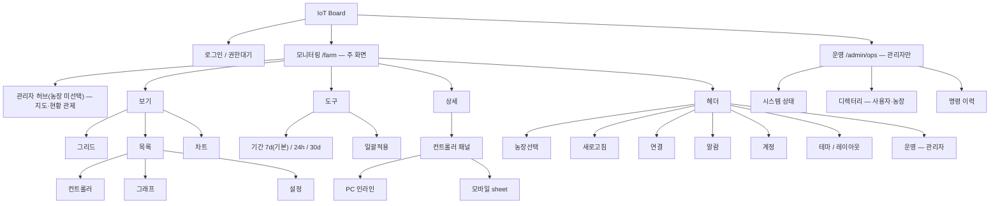
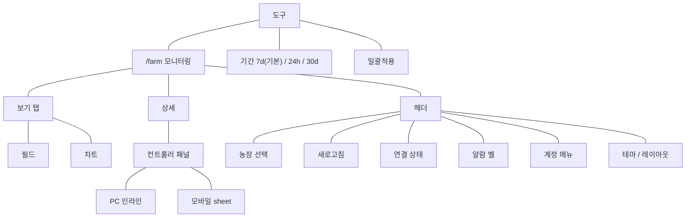
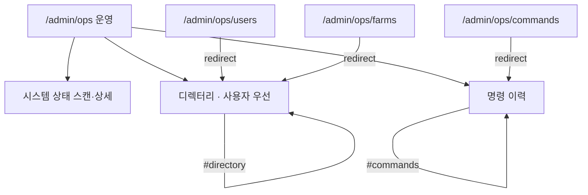

# 10. 메뉴구조도

대시보드의 최상위 메뉴는 **모니터링**(`/farm`)과 **운영**(`/admin/ops`, 관리자만) 두 축입니다. 아래는 라우트·헤더·하단 내비·화면 안 모드를 한눈에 본 구조입니다.

개발용 URL·shallow·epoch 계약: [../farm-hub-url.md](../farm-hub-url.md)  
문서 찾기(전 Agent): [../README.md](../README.md)

## 허브 URL과의 정합 (요약)

| 사용자 메뉴 | URL (`view` 등) |
|-------------|-----------------|
| 필드 | `view` 없음 (= map). 레거시 `view=list`도 필드 |
| 차트 | `view=chart` (+ `chartW1`/`chartW2` 목록·펼침. 비교는 보류) |
| 기간 | `trendPeriod` (`7d`는 URL 생략, `24h`/`30d`만 명시) |

레거시 `tab=ops|…` 는 메뉴에 없고, 미들웨어·페이지가 `/farm`으로 정리합니다. 상세는 위 계약 문서.

## 전체 메뉴 트리

- **PC**: 헤더 **운영** 버튼으로 `/farm` ↔ `/admin/ops` 토글
- **모바일**: 하단 내비는 **모니터링**(`/farm`)만. 관리자 **운영**은 헤더 도구에서 전환

## 모니터링 화면 안 메뉴

`/farm` 한 경로 안에서 탭·모드로 전환합니다. (별도 페이지 URL이 아닌 UI)

관련 절: [01-그리드](./01-모니터링-그리드.md) · [02-목록](./02-모니터링-목록.md) · [11-차트](./11-모니터링-차트.md) · [12-델린](./12-ARIA.md)(우측 하단 뱃지) · [03-일괄적용](./03-일괄적용.md) · [04-설정](./04-컨트롤러-설정.md) · [05-헤더](./05-헤더와-알람.md) · [08-모바일](./08-모바일.md)

## 운영 화면 안 블록 (관리자)

`/admin/ops`는 단일 페이지이며, 하위 경로는 앵커로 이어집니다.

관련 절: [06-운영](./06-운영-관리자.md) · [07-전국허브](./07-전국허브-관리자.md)

## 역할별 메뉴 노출

| 메뉴 | 관리자 (admin) | 운영자 (operator) | 뷰어 (viewer) |
|------|----------------|-------------------|---------------|
| 모니터링 `/farm` | ○ | ○ | ○ |
| 운영 `/admin/ops` | ○ (헤더) | ✕ | ✕ |
| 일괄적용 | ○ | `canCommand`일 때 | ✕ 미표시 |

세부 권한·잠금은 [09-역할별-차이.md](./09-역할별-차이.md)를 보세요.

## 레거시 (메뉴에 없음)

다음 경로는 **메뉴에 두지 않습니다**. 접속 시 모니터링 등으로 이동합니다.

- `/settings`, `/alarms`, `/controllers`, `/play` → `/farm` (또는 동등 통합)
- `/admin/ops/users`, `/admin/ops/farms` → `/admin/ops#directory`
- `/admin/ops/commands` → `/admin/ops#commands`
- 쿼리 `tab=ops|…` → `/farm`으로 정리 (신규 코드는 `tab` 미사용)
- `view=aria` · `view=jarvis` → 필드(`view` 없음)로 정규화. 델린은 상단 탭이 아니라 필드 **우측 하단 뱃지**입니다. 차트·목록에서는 숨깁니다.
- `view=chartlab` → 차트(`view=chart`)로 정규화.
